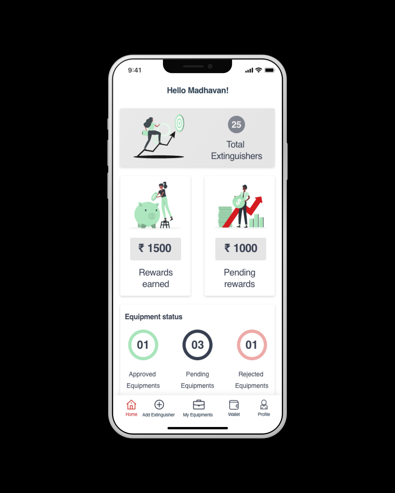
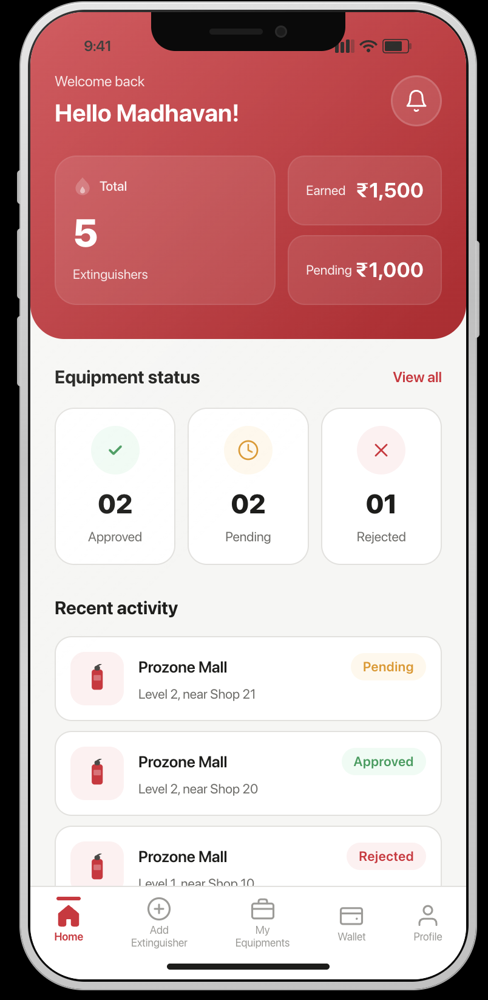

# ABC Fire Redesign — "More Work" Page Plan

## Summary

A new supporting project page (`abc-fire.html`) for the ABC Fire consumer app redesign with gamification. This page sits outside the primary case study tier — it's shorter, lighter, and video-led. It adds consumer-facing design, growth thinking, and AI-collaboration to a portfolio that's currently all B2B/enterprise.

**Two deliverables:**
1. New page: `abc-fire.html`
2. Homepage addition: "More work" section in `index.html` (between projects list and contact)

---

## Design Decisions

### Accent color: Lemon (`#E8D88A`)
- Lavender → Item Management, Mint → RxToGo, Sky → Allocatr
- Lemon is the only pastel unused; its warmth suits a consumer/gamification context

### Page tier: Supporting project, not full case study
- No meta row complexity, no password-protected CTA
- 4 tight text blocks (40–60 words each) + video + before/after + visual metrics
- Back link instead of project-to-project nav

### Results section: Visual metrics, not prose
- Use `.impact-card` grid (3-column) with large numbers + descriptors
- Lemon accent on numbers
- One honest qualifier note below in small `--text-muted` text
- This replaces any paragraph-style outcomes section

---

## Assets Available (from repo root)

| Asset | Usage |
|---|---|
| `ABC_Ptf_Vid.mov` | Hero video — autoplay muted loop |
| `ABCFire_HomeScreen_OldDesign_Before image.png` | Before screenshot in comparison |
| `ABC_New design_After image.png` | After screenshot in comparison |

> **File name note:** The before/after images have spaces in their names. Reference them with URL-encoded paths in HTML: `ABCFire_HomeScreen_OldDesign_Before%20image.png` or rename to `ABCFire_Before.png` and `ABCFire_After.png` before build (recommended — avoids edge cases in some browsers).

---

## Page Structure: `abc-fire.html`

### HEAD
```html
<title>ABC Fire Redesign — Adhith Shanmuga Sundaram</title>
```
- Same meta, Geist font link, Vercel analytics script, CSS variables as all other pages
- No prefetch links needed (secondary page)

---

### NAV
Identical to all other pages — logo + Home / About / Resume links.

---

### HERO
```
[hero-tag]  Personal Project · Consumer App · 2024
[h1]        ABC Fire — Consumer App Redesign
[p.hero-description]  Revisiting an early design with fresh eyes: consumer-facing gamification, growth loops, and AI as a collaborative design tool.
[hero-image container]
  <video src="ABC_Ptf_Vid.mov" autoplay loop muted playsinline preload="none" class="section-video">
```

- Container: `div.hero-image` with `aspect-ratio: 16 / 8`
- Video: `object-fit: contain`, `background: var(--bg-card)`
- Same fade-up stagger animations on tag (0s), h1 (0.1s), description (0.2s), video (0.3s)
- Lemon radial gradient pseudo-element behind hero (replaces lavender/mint from other pages)

---

### TEXT BLOCK 1 — The Brief
```
section-label--peach  "The Brief"
h2                    What the app needed to do
p (40–60 words)       ABC Fire was built to activate passive users and create a revenue path through task completion. The original app solved the core task-tracking problem but left growth mechanics and user motivation untouched — users arrived, completed a task, and left with no reason to return.
```

---

### TEXT BLOCK 2 — AI as Design Collaborator
```
section-label--lemon  "AI Collaboration"
h2                    Using Claude to pressure-test, not to generate
p (40–60 words)       I used Claude to stress-test the information architecture, surface gamification frameworks I hadn't considered, and challenge the monetization logic. It helped me move faster through exploration — but every structural decision, every hierarchy call, every interaction pattern came from my own judgment. The AI accelerated the thinking; it didn't replace it.
```

> **Why this block matters:** It preempts the "did AI just do this?" question. Be specific and own the judgment calls clearly.

---

### TEXT BLOCK 3 — Design Decisions
```
section-label--sky    "Design Decisions"
h2                    Making motivation visible
p (40–60 words)       The core redesign decision was surfacing progress as a first-class UI element. Points, streaks, and milestone markers aren't decorations — they're feedback loops that answer "why should I come back?" The gamification layer was designed to feel earned, not bolted on: every mechanic tied directly to a real user action.
```

---

### TEXT BLOCK 4 — Pilot Outcomes (text portion)
```
section-label--mint   "Pilot Outcomes"
h2                    What the pilot showed
p (40–60 words)       140 new clientele were acquired by 60 users during the pilot period — suggesting the flow's ability to lower acquisition friction. These results are from the original design; the redesign doesn't change the outcome, it builds on the validated mechanic to make it more legible and repeatable at scale.
```

---

### BEFORE / AFTER COMPARISON

Two screenshots side by side. Uses existing `.image-placeholders` 2-column grid.

```html
<div class="image-placeholders animate-on-scroll">
  <div>
    <!-- Before pill label (inline styles, same pattern as item-management.html) -->
    <div style="display:flex;flex-direction:column;align-items:center;gap:6px;margin-bottom:12px;">
      <span style="font-size:0.6875rem;font-weight:600;letter-spacing:0.08em;text-transform:uppercase;
        color:var(--text-muted);background:rgba(136,136,136,0.1);padding:3px 10px;border-radius:20px;">
        Before
      </span>
    </div>
    <div class="image-placeholder">
      
    </div>
    <p class="image-caption">Original home screen — task-tracking without engagement mechanics</p>
  </div>
  <div>
    <!-- After pill label -->
    <div style="display:flex;flex-direction:column;align-items:center;gap:6px;margin-bottom:12px;">
      <span style="font-size:0.6875rem;font-weight:600;letter-spacing:0.08em;text-transform:uppercase;
        color:var(--pastel-lemon);background:rgba(232,216,138,0.1);padding:3px 10px;border-radius:20px;">
        After
      </span>
    </div>
    <div class="image-placeholder">
      
    </div>
    <p class="image-caption">Redesigned — progress surfaced as a first-class UI element</p>
  </div>
</div>
```

---

### RESULTS — Visual Metrics Grid

2-column `.impact-grid` (two strong numbers; cleaner than a sparse 3-column). Numbers in lemon accent. One honest qualifier note below.

```html
<div class="section-label section-label--lemon">Results</div>
<h2>Pilot numbers</h2>

<div class="impact-grid animate-on-scroll" style="grid-template-columns: repeat(2, 1fr);">
  <div class="impact-card">
    <div class="impact-number" style="color:var(--pastel-lemon);">60</div>
    <div class="impact-desc">Unique users in pilot cohort</div>
  </div>
  <div class="impact-card">
    <div class="impact-number" style="color:var(--pastel-lemon);">140</div>
    <div class="impact-desc">New clientele acquired by 60 users during the pilot period</div>
  </div>
</div>

<p style="text-align:center;font-size:0.8125rem;color:var(--text-muted);margin-top:20px;max-width:560px;margin-left:auto;margin-right:auto;line-height:1.6;">
  Results from the original design's pilot — suggesting the flow's ability to lower acquisition friction. The redesign builds on this validated baseline.
</p>
```

> **Why 2-column instead of 3:** Two real numbers displayed confidently is stronger than two real + one missing/padded stat. The `grid-template-columns` override on the div keeps the existing `.impact-grid` responsive behavior intact at mobile.

---

### BACK LINK

```html
<div class="container animate-on-scroll" style="text-align:center;padding-top:40px;padding-bottom:80px;">
  <a href="index.html" style="font-size:0.9375rem;color:var(--text-muted);text-decoration:none;
    border-bottom:1px solid var(--border-subtle);padding-bottom:2px;
    transition:color 0.2s,border-color 0.2s;"
    onmouseover="this.style.color='var(--pastel-lemon)';this.style.borderColor='var(--pastel-lemon)'"
    onmouseout="this.style.color='var(--text-muted)';this.style.borderColor='var(--border-subtle)'">
    ← Back to all work
  </a>
</div>
```

---

### FOOTER
Identical to all other pages.

---

### SCRIPT BLOCK (end of body)
Combine both IntersectionObserver patterns — scroll animations AND lazy video load:

```html
<script>
  // Scroll reveal
  const observer = new IntersectionObserver((entries) => {
    entries.forEach(entry => {
      if (entry.isIntersecting) entry.target.classList.add('visible');
    });
  }, { threshold: 0.1 });
  document.querySelectorAll('.animate-on-scroll').forEach(el => observer.observe(el));

  // Lazy video play/pause
  const videoObserver = new IntersectionObserver((entries) => {
    entries.forEach(entry => {
      const vid = entry.target;
      if (entry.isIntersecting) {
        if (vid.readyState === 0) {
          vid.preload = 'auto';
          vid.load();
          vid.addEventListener('canplay', () => vid.play().catch(() => {}), { once: true });
        } else {
          vid.play().catch(() => {});
        }
      } else {
        vid.pause();
      }
    });
  }, { threshold: 0.1 });
  document.querySelectorAll('video[autoplay]').forEach(v => videoObserver.observe(v));
</script>
</body>
</html>
```

---

## Homepage Changes: `index.html`

Add a "More work" section **between** `.work-section` and `.contact-section`. This gives readers who finish the three main projects a visible next step without crowding the primary grid.

### New CSS (add to `<style>` block in index.html)

```css
/* ─── MORE WORK ─── */
.more-work-section {
  padding-top: 16px;
  padding-bottom: var(--section-gap);
}

.more-work-label {
  font-size: 0.75rem;
  font-weight: 700;
  text-transform: uppercase;
  letter-spacing: 0.1em;
  color: var(--text-muted);
  margin-bottom: 20px;
}

.more-work-card {
  display: flex;
  align-items: center;
  gap: 24px;
  padding: 24px 28px;
  border: 1px solid var(--border-subtle);
  border-radius: 14px;
  background: var(--bg-card);
  text-decoration: none;
  transition: border-color 0.2s, background 0.2s, transform 0.2s;
}

.more-work-card:hover {
  border-color: var(--pastel-lemon);
  background: var(--bg-card-hover);
  transform: translateY(-2px);
}

.more-work-meta {
  display: flex;
  gap: 6px;
  flex-wrap: wrap;
  min-width: 200px;
}

.more-work-body {
  flex: 1;
}

.more-work-title {
  font-size: 1rem;
  font-weight: 600;
  color: var(--text-primary);
  margin-bottom: 6px;
}

.more-work-desc {
  font-size: 0.875rem;
  color: var(--text-secondary);
  line-height: 1.55;
}

.more-work-cta {
  font-size: 0.875rem;
  font-weight: 500;
  color: var(--pastel-lemon);
  white-space: nowrap;
  opacity: 0.7;
  transition: opacity 0.2s, gap 0.2s;
}

.more-work-card:hover .more-work-cta {
  opacity: 1;
}

@media (max-width: 640px) {
  .more-work-card {
    flex-direction: column;
    align-items: flex-start;
    gap: 16px;
  }
  .more-work-meta { min-width: unset; }
}
```

### New HTML (insert between `</section>` of work section and `<section class="contact-section">`)

```html
<section class="more-work-section container animate-on-scroll">
  <h3 class="more-work-label">More work</h3>
  <a class="more-work-card" href="abc-fire.html" onclick="va('event', { name: 'case_study_clicked', data: { project: 'abc-fire', source: 'more-work' } })">
    <div class="more-work-meta">
      <span class="project-tag">Personal Project</span>
      <span class="project-tag">Consumer App</span>
      <span class="project-tag">Gamification</span>
    </div>
    <div class="more-work-body">
      <div class="more-work-title">ABC Fire — Consumer App Redesign</div>
      <div class="more-work-desc">Consumer-facing gamified app redesign with AI as a design collaborator. Explores growth mechanics, behavioral design, and engagement loops.</div>
    </div>
    <span class="more-work-cta">View project →</span>
  </a>
</section>
```

---

## Pre-build Checklist

- [ ] Rename image files to remove spaces: `ABCFire_Before.png`, `ABCFire_After.png`
- [ ] Convert `.mov` to `.mp4` for browser compatibility: `ffmpeg -i ABC_Ptf_Vid.mov -vcodec h264 -acodec aac ABC_Ptf_Vid.mp4`
- [x] Pilot numbers confirmed: 60 unique users, 140 new clientele acquired
- [ ] Verify video plays muted and loops correctly in Chrome/Safari
- [ ] Check before/after images display correctly with `object-fit: contain`
- [ ] Test mobile layout at 375px (before/after should stack, more-work card should stack)
- [ ] Add `abc-fire.html` to `rel="prefetch"` links on index.html after verifying page loads cleanly

---

## Section Order Summary for `abc-fire.html`

```
NAV
HERO          tag + h1 + description + autoplay video
BLOCK 1       The Brief (peach)
BLOCK 2       AI Collaboration (lemon)
BLOCK 3       Design Decisions (sky)
BLOCK 4       Pilot Outcomes — text (mint)
BEFORE/AFTER  2-column screenshot comparison
RESULTS       3-column visual impact-card grid (lemon numbers)
BACK LINK     ← Back to all work
FOOTER
SCRIPTS       scroll reveal + lazy video
```

Total estimated read time: ~2 minutes. Right for a supporting project page.
